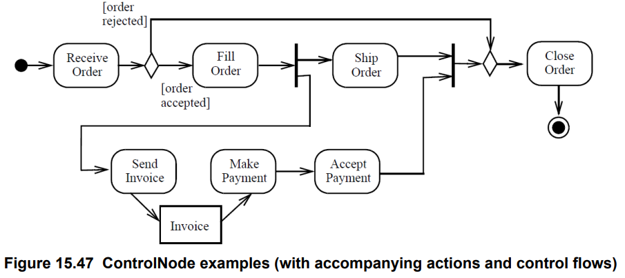

# Software: OrderMan

This software implements an **Order Management** system.

**Reference**: [Unified Modeling Language version 2.5.1, Section 15.3.5.5](https://www.omg.org/spec/UML/2.5.1/PDF)

# Design

Use AGL to implement activity-based modules.

Main activity diagram of OrderMan: 

